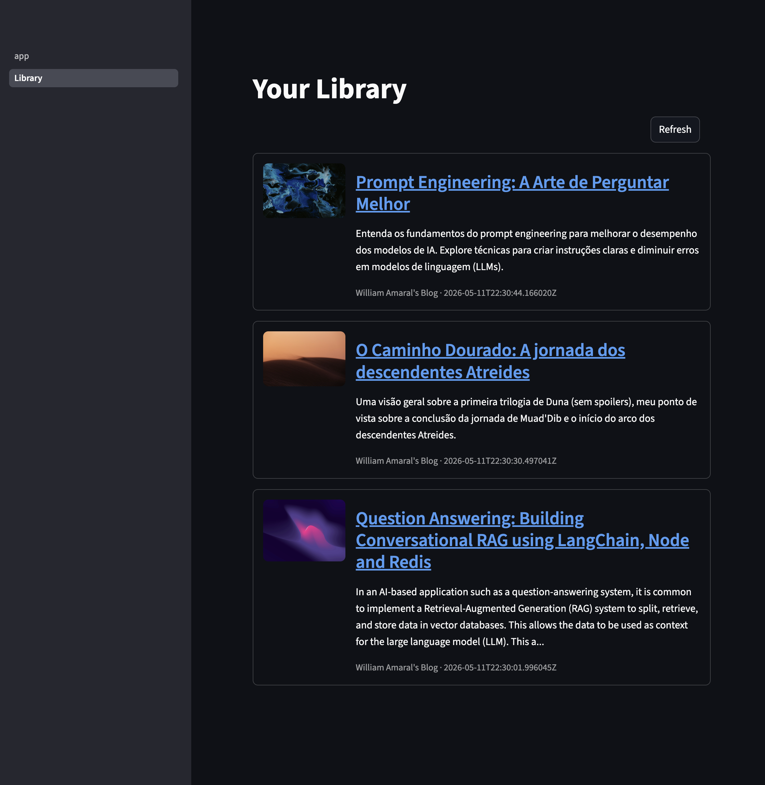

# ReadLater

A minimal personal read-it-later app. Paste a URL, the backend fetches the page and extracts Open Graph / Twitter Card / standard `<meta>` tags, and the result is stored in a local JSON file. A second page lists everything saved so far.

No accounts, no sync, no editing — see [`spec.md`](spec.md) for the full requirements.



## Stack

- **Frontend** — Streamlit
- **Backend** — FastAPI (Uvicorn)
- **Metadata** — `requests` + BeautifulSoup
- **Storage** — TinyDB (single JSON file at `backend/data/items.json`)

## Setup & Run

Its recommended to use `Make` to simplify the setup and running process:

> Execute the following command at root directory

```shell
make run
```

The frontend reads `BACKEND_URL` (default `http://localhost:8000`) and the backend reads `DB_PATH` (default `backend/data/items.json`).

> Find more details in the `Makefile`
